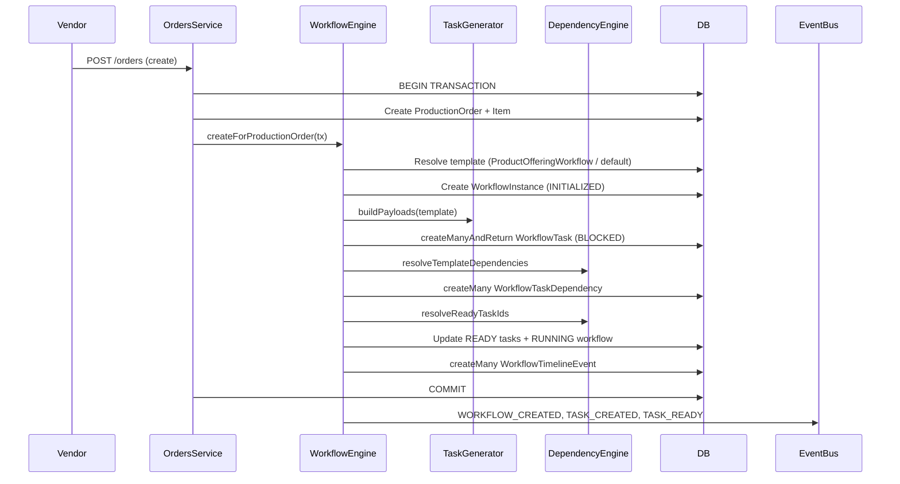

# Milestone 1 — Workflow Execution Engine

Implementation reference for the backend Workflow Execution Engine (Milestone 1 only).

**Status:** Implemented  
**Scope:** Backend orchestration only — no department dashboards, assignment UI, machine registry, planning, QC modules, dispatch UI, or production dashboard.

---

## Objective

When a vendor order is successfully created, the system automatically:

1. Creates a **Workflow Instance** from the product’s workflow template
2. Generates all **Workflow Tasks** (one per template step)
3. Resolves **dependencies** and marks initial tasks as **READY**
4. Writes **timeline events**
5. Publishes **domain events** (in-process, no email/SMS)

Everything is **generic** — driven by `WorkflowTemplate`, `WorkflowTemplateStep`, and `ProductOfferingWorkflow`. No product-specific or hardcoded steps in engine code.

---

## Architecture



---

## Components

| Component | File | Responsibility |
|-----------|------|----------------|
| **WorkflowEngine** | `workflow.engine.ts` | Orchestration: create workflow, advance tasks, publish events |
| **WorkflowRepository** | `workflow.repository.ts` | Optimized Prisma queries, bulk operations, cursor pagination |
| **TaskGeneratorService** | `task-generator.service.ts` | Map template steps → task payloads + dependency edges |
| **DependencyEngine** | `dependency-engine.ts` | Pure logic: implicit/explicit deps, READY resolution |
| **TaskStateMachine** | `task-state-machine.ts` | Validated task status transitions |
| **WorkflowInstanceStateMachine** | `workflow-instance-state-machine.ts` | Validated workflow status transitions |
| **WorkflowTimelineService** | `workflow-timeline.service.ts` | Generic timeline event builders + bulk insert |
| **WorkflowService** | `workflow.service.ts` | API-facing read/advance operations |
| **WorkflowTemplateCache** | `workflow.cache.ts` | Redis cache for template resolution (5 min TTL) |

---

## Data Model (Milestone 1 extensions)

### WorkflowInstance

- Links: `orderId`, `productionOrderItemId` (unique), `workflowTemplateId`
- State: `status`, `currentStepOrder`, `startedAt`, `completedAt`
- Audit: `templateVersion`, `createdById`, `metadata`

### WorkflowTask

- Links: `workflowInstanceId`, `workflowTemplateStepId`, `departmentId`
- Execution: `stepOrder`, `priority`, `estimatedMinutes`, `instructions`, `metadata`
- State: `status` (default `BLOCKED`)

### WorkflowTaskDependency

- Mirrors template step dependencies at runtime
- Types: `FINISH_TO_START`, `START_TO_START`

### WorkflowTimelineEvent

- Generic audit trail: `entityType`, `entityId`, `eventType`, `title`, `metadata`

### WorkflowTemplateStepDependency

- Template-level dependency graph (optional; falls back to implicit sequential chain)

---

## State Machines

### Workflow Instance

| Status | Meaning |
|--------|---------|
| `DRAFT` | Reserved for future manual workflows |
| `INITIALIZED` | Instance created, tasks generated |
| `RUNNING` | At least one task is active/ready |
| `PAUSED` | Production halted |
| `COMPLETED` | All mandatory tasks terminal |
| `CANCELLED` | Workflow aborted |
| `FAILED` | Unrecoverable failure |

Key transitions: `INITIALIZED → RUNNING → COMPLETED`. Illegal transitions throw `ApiError.conflict`.

### Workflow Task

| Status | Meaning |
|--------|---------|
| `BLOCKED` | Waiting on dependencies |
| `READY` | Available for assignment/execution |
| `ASSIGNED` / `IN_PROGRESS` | Active work |
| `COMPLETED` / `SKIPPED` / `CANCELLED` | Terminal |

Validated in `task-state-machine.ts` and `workflow-instance-state-machine.ts`.

---

## Task Generation Flow

1. Load `WorkflowTemplate` with ordered steps + step dependencies
2. Resolve template via `ProductOfferingWorkflow` for the product version, else `isDefault: true` + `ACTIVE`
3. For each step → create `WorkflowTask` with `status: BLOCKED`
4. Build dependency edges:
   - **If template has explicit dependencies** → use them exclusively
   - **Else** → implicit `FINISH_TO_START` chain by `stepOrder`
5. Run `resolveReadyTaskIds()` — tasks with no unsatisfied incoming deps become `READY`
6. If any task is READY → workflow transitions to `RUNNING`, `startedAt` set

---

## Dependency Resolution

| Type | Rule |
|------|------|
| **Sequential** | Default implicit chain when no explicit deps |
| **Parallel** | Multiple steps with no incoming deps → all READY initially |
| **Conditional** | Reserved via template metadata (future branching) |
| **Optional / Skipped** | `allowSkip` on template step; `SKIPPED` satisfies FINISH_TO_START |
| **START_TO_START** | Prerequisite must be `IN_PROGRESS`, `COMPLETED`, or `SKIPPED` |

Engine function: `resolveReadyTaskIds(tasks, dependencies, statusByTaskId)`.

---

## Transaction Flow

Workflow creation runs **inside the order creation transaction** (`orders.service.ts`):

```typescript
await prisma.$transaction(async (tx) => {
  // ... order, item, wallet, artwork ...
  const workflowResult = await workflowEngine.createForProductionOrder({ ... }, tx);
});
workflowEngine.publishCreationEvents(workflowResult); // after commit
```

If any step fails (missing template, task insert error, etc.), the entire order is rolled back — **no partial workflow**.

---

## Domain Events

Published via `eventBus` after successful commit:

| Event | When |
|-------|------|
| `workflow:created` | Workflow instance created |
| `workflow:task_created` | All tasks bulk-created `{ taskIds, count }` |
| `workflow:task_ready` | Task becomes READY |
| `workflow:task_completed` | Task completed via advance |
| `workflow:completed` | All tasks terminal |
| `workflow:cancelled` | Reserved for future cancel flow |

Listeners: `src/events/listeners/workflow.listeners.ts` (logging only in M1).

---

## Timeline Events

| Event Type | Trigger |
|------------|---------|
| `WORKFLOW_CREATED` | Instance created |
| `TASKS_GENERATED` | Tasks bulk inserted |
| `TASK_READY` | Task unlocked |
| `TASK_ACTIVATED` | Task enters production queue |
| `TASK_COMPLETED` | Task finished |
| `WORKFLOW_COMPLETED` | All tasks done |
| `STATUS_CHANGED` | Workflow status transition |

Stored in `workflow_timeline_events` — reusable for any future UI.

---

## API Endpoints

Base: `/api/v1/workflow`

| Method | Path | Auth | Description |
|--------|------|------|-------------|
| `GET` | `/orders/:orderId` | Admin/Manager/Vendor | Workflow by order |
| `GET` | `/:id` | Admin/Manager/Vendor | Workflow instance detail |
| `GET` | `/:id/tasks` | Admin/Manager | Cursor-paginated tasks |
| `GET` | `/:id/timeline` | Admin/Manager | Cursor-paginated timeline |
| `POST` | `/:id/advance` | Admin/Manager | Internal: complete/skip/cancel task |

Advance body:

```json
{
  "taskId": "cuid",
  "action": "complete" | "skip" | "cancel",
  "remarks": "optional"
}
```

---

## Performance Strategy

Designed for **50,000+ orders**:

- **Single transaction** for order + workflow + tasks + deps + timeline
- **`createManyAndReturn`** for tasks (bulk insert, returns IDs)
- **`createMany`** for dependencies, timeline, task history
- **Composite indexes** on `(workflowInstanceId, stepOrder)`, `(departmentId, status, priority, dueAt)`
- **Cursor pagination** on tasks and timeline (no offset scans)
- **Redis template cache** (`workflow.cache.ts`, 5 min TTL)
- **Request-scoped cache** available via existing `RequestCache` infrastructure
- **No N+1** — template loaded once with nested steps/deps; tasks loaded in one query

---

## Seed Data

`prisma/seed/master/production-workflow.seed.ts`:

- Facility: `GEETA-MAIN`
- Departments: `ARTWORK`, `PRINT`, `QC`, `PACKING`, `DISPATCH`
- Template: `WF-STANDARD-PRODUCTION` (default, 5 sequential steps)
- Links all active product versions via `ProductOfferingWorkflow`

Run: `npm run seed:master`

---

## Tests

```bash
npm run test:workflow
```

| Suite | Coverage |
|-------|----------|
| `task-state-machine` | Valid/invalid transitions, dependency satisfaction |
| `workflow-instance-state-machine` | Workflow transition validation |
| `dependency-engine` | Implicit chain, explicit deps, READY resolution |

Integration tests against a live DB can be added with `TEST_INTEGRATION=1` in a future pass.

---

## Future Extension Points

Milestone 1 intentionally leaves hooks for later milestones:

| Future Module | Extension Point |
|---------------|-----------------|
| **Assignment** | `READY → ASSIGNED` transition, `assignedToId` on task |
| **Machine Registry** | `assignedMachineId` already on schema |
| **Department Dashboard** | Query `workflow_tasks` by `departmentId + status` |
| **Planning Board** | Template metadata + conditional deps |
| **QC / Rework** | `REJECTED → REWORK → READY` transitions |
| **Dispatch** | Final step type `DISPATCH` in template |
| **Notifications** | Subscribe to `APP_EVENTS.TASK_READY` etc. |
| **Branching** | `WorkflowTemplateStepDependency` + metadata conditions |
| **Background jobs** | BullMQ worker for bulk workflow replay / SLA |

New departments (UV, Foiling, Lamination, Embossing, Die Cutting, Binding) require **only template configuration** — no engine code changes.

---

## File Index

```
backend/src/modules/workflow/
├── workflow.engine.ts          # Core orchestrator
├── workflow.repository.ts      # Data access
├── workflow.service.ts         # API service
├── workflow.controller.ts
├── workflow.routes.ts
├── task-generator.service.ts
├── dependency-engine.ts
├── task-state-machine.ts
├── workflow-instance-state-machine.ts
├── workflow-timeline.service.ts
├── workflow.cache.ts
├── workflow.constants.ts
├── workflow.validation.ts
├── workflow.utils.ts
└── __tests__/workflow-engine.unit.test.ts

backend/prisma/migrations/20260625120000_workflow_execution_engine_m1/
backend/prisma/seed/master/production-workflow.seed.ts
docs/IMPLEMENTATION_MILESTONE_01_WORKFLOW_ENGINE.md
```

---

## Related Architecture Docs

- `docs/15-production-erp-blueprint.md`
- `docs/18-production-data-model.md`
- `docs/21-enterprise-domain-architecture.md`
