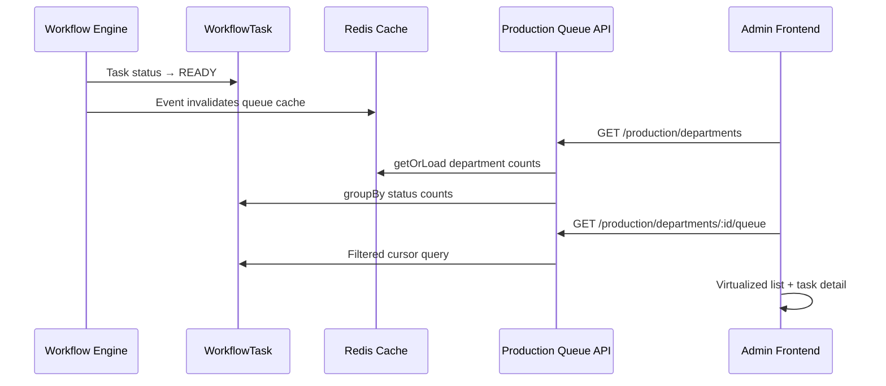

# Milestone 2 — Department Queue Engine

Implementation reference for department-level production work queues.

**Status:** Implemented  
**Depends on:** Milestone 1 Workflow Execution Engine  
**Scope:** Read-only department queues — no assignment, machine allocation, operator dashboard, planning, QC, or dispatch.

---

## Objective

When a workflow task becomes **READY**, it automatically appears in its department's live queue. Departments can browse, search, filter, and inspect tasks — nothing more.

```
Workflow Engine creates tasks
  → Task becomes READY
  → Task appears in department queue (by task.departmentId)
  → Department user views / searches / inspects
```

Queues are **views over `WorkflowTask`** — no new queue tables.

---

## Architecture



---

## Backend Module

```
backend/src/modules/production/queue/
├── queue.routes.ts
├── queue.controller.ts
├── queue.service.ts
├── queue.repository.ts
├── queue.dto.ts
├── queue.validation.ts
├── queue.filters.ts          # Pure where/order builders
├── queue.access.ts           # Department RBAC
├── queue.cache.ts
├── queue.constants.ts
├── index.ts
└── __tests__/queue.unit.test.ts
```

Registered at: `GET /api/v1/production/*`

---

## API Endpoints

| Method | Path | Description |
|--------|------|-------------|
| `GET` | `/production/departments` | All departments + live counts |
| `GET` | `/production/departments/:departmentId/queue` | Cursor-paginated queue items |
| `GET` | `/production/departments/:departmentId/queue/:taskId` | Read-only task detail |

### Department counts

Each department returns:

| Metric | Source |
|--------|--------|
| Ready | `status = READY` |
| Blocked | `status = BLOCKED` |
| Completed today | `COMPLETED` + `completedAt` today |
| Rush | `priority IN (URGENT, HIGH)` + active |
| Delayed | `dueAt < now` + active |
| In progress | `ASSIGNED` + `IN_PROGRESS` |

### Queue filters

| Filter | Parameter |
|--------|-----------|
| Task status | `status` |
| Priority | `priority` |
| Workflow status | `workflowStatus` |
| Vendor | `vendorId` |
| Product | `productId` |
| Order number | `orderNumber` |
| Created date | `createdFrom`, `createdTo` |
| Due date | `dueFrom`, `dueTo` |
| Quick lenses | `lens=rush\|rework\|blocked\|completedToday\|delayed` |
| Sort | `sortBy`, `sortDir` |
| Search | `search` (order, vendor, product, task/workflow IDs) |
| Pagination | `cursor`, `limit` |

---

## Queue Item Payload

Each card includes:

- Order number, vendor, product, department, workflow step
- Priority, status, created/ due times, estimated duration
- Workflow progress (percent + step counts)
- Badges: Rush, Rework, Blocked

Task detail adds:

- Order summary, configuration snapshots, artwork files, attachments
- Workflow visualization (completed / current / future steps)
- Previous / next task, timeline, comments (from task history)
- Dependencies (read-only)

---

## Security (RBAC)

| Role | Access |
|------|--------|
| `SUPER_ADMIN`, `ADMIN`, `MANAGER` | All departments |
| `STAFF` | Departments matching `production.queue.dept:{CODE}` permissions |

Permissions (seed updated):

- `production.queue:*` — Admin/Manager full access
- `production.queue.dept:ARTWORK` etc. — Staff scoped access

Helper: `queue.access.ts` → `assertDepartmentAccess()`

---

## Caching

| Key | TTL | Content |
|-----|-----|---------|
| `production-queue:departments:v1` | 30s | Department list + counts |
| `production-queue:dept:{id}:{hash}` | 15s | Filtered queue page |

**Invalidation** on workflow events (`production-queue.listeners.ts`):

- `TASK_READY`, `TASK_COMPLETED`, `TASK_CREATED`
- `WORKFLOW_CREATED`, `WORKFLOW_COMPLETED`, `WORKFLOW_CANCELLED`

---

## Performance

- **Cursor pagination** — no offset scans
- **Minimal Prisma selects** — `QUEUE_TASK_LIST_SELECT` / `QUEUE_TASK_DETAIL_SELECT`
- **Single groupBy** for department status counts + parallel count queries
- **Redis cache** with event-driven invalidation
- **Index reuse** — `(departmentId, status, priority, dueAt)` from M1 schema
- **No N+1** — nested select in one query per page

Target: 50,000+ orders with paginated, cached reads.

---

## Frontend

```
frontend/src/features/production-queue/
├── components/
│   ├── department-queues-page.tsx      # Department index
│   ├── department-queue-page.tsx       # Virtualized queue list
│   ├── queue-task-detail-page.tsx      # Read-only detail
│   ├── queue-task-card.tsx
│   ├── queue-status-badge.tsx
│   └── workflow-progress-viz.tsx
├── hooks/use-production-queue-queries.ts
├── services/production-queue.service.ts
└── types/production-queue.types.ts
```

Routes:

- `/admin/production/queues` — department index
- `/admin/production/queues/[departmentId]` — queue list
- `/admin/production/queues/[departmentId]/[taskId]` — task detail

Features: TailAdmin-style cards, sticky filters, `@tanstack/react-virtual`, skeleton loading, empty/error states, dark-mode classes, 30s auto-refresh.

---

## Tests

```bash
cd backend
npm run test:queue
```

Covers: RBAC access rules, filter where-clause building, sort order, search OR clauses.

---

## Future: Assignment Integration (Milestone 3+)

The queue module intentionally does **not** mutate tasks. Future assignment will:

1. Add `POST /production/tasks/:id/claim` in a separate module
2. Use `task-state-machine.ts` for `READY → ASSIGNED`
3. Invalidate queue cache on assignment events
4. Add "Claim" button to queue UI (currently read-only)

No changes to Workflow Engine required.

---

## Related Docs

- `docs/IMPLEMENTATION_MILESTONE_01_WORKFLOW_ENGINE.md`
- `docs/19-production-control-center.md`
- `docs/21-enterprise-domain-architecture.md`
