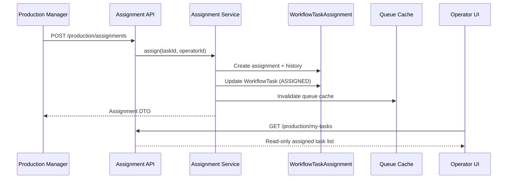

# Milestone 3 — Task Assignment Engine

Implementation reference for assigning workflow tasks to production operators.

**Status:** Implemented  
**Depends on:** Milestone 1 Workflow Engine, Milestone 2 Department Queue  
**Scope:** Assignment only — no task start, pause, complete, reject, rework, QC, or machine execution.

---

## Objective

Production managers assign READY queue tasks to operators (optionally to a machine). Operators see assigned tasks in a read-only workspace. Nothing executes yet.

```
Workflow Task (READY)
  → Department Queue
  → Manager assigns operator
  → (Optional) machine on record
  → Task status → ASSIGNED
  → Operator sees task in My Assigned Tasks
```

---

## Architecture



Assignment is a **separate bounded context** from the Workflow Engine. The engine is not modified; `task-state-machine.ts` validates `READY → ASSIGNED` transitions only.

---

## Data Model

### `WorkflowTaskAssignment`

| Field | Purpose |
|-------|---------|
| `workflowTaskId` | Linked task |
| `operatorId` | Assigned operator |
| `departmentId` | Task department snapshot |
| `machineId` | Optional machine (schema ready; UI/API optional) |
| `assignedById` | Manager who assigned |
| `assignedAt` | Assignment timestamp |
| `priority`, `dueAt`, `estimatedMinutes`, `remarks` | Assignment metadata |
| `status` | `ACTIVE`, `SUPERSEDED`, `UNASSIGNED` |

**Constraint:** Partial unique index — one `ACTIVE` assignment per task.

### `WorkflowTaskAssignmentHistory` (immutable)

Actions: `ASSIGNED`, `REASSIGNED`, `UNASSIGNED`, `PRIORITY_CHANGED`, `DUE_DATE_CHANGED`, `OPERATOR_CHANGED`, `REMARKS_CHANGED`.

Reassignment **supersedes** the previous row and appends history — history is never overwritten.

### `UserDepartmentAssignment`

Links operators to departments with `DepartmentStaffRole` (`OPERATOR`, `SUPERVISOR`, etc.) for validation.

---

## Backend Module

```
backend/src/modules/production/assignment/
├── assignment.routes.ts
├── assignment.controller.ts
├── assignment.service.ts
├── assignment.repository.ts
├── assignment.dto.ts
├── assignment.validation.ts
├── assignment.access.ts
├── assignment.constants.ts
├── index.ts
└── __tests__/assignment.unit.test.ts
```

Registered at: `/api/v1/production/*` (alongside queue routes).

---

## Repositories

### `AssignmentRepository`

| Method | Purpose |
|--------|---------|
| `findTaskForAssignment` | Task + department + step for validation |
| `findActiveAssignment` | Current ACTIVE assignment by task |
| `findActiveAssignmentById` | Load assignment with relations |
| `searchDepartmentOperators` | Cursor-free operator search by department |
| `listMyAssignedTasks` | Operator workspace (cursor pagination) |
| `listAssignmentHistory` | Immutable history for a task |

Minimal Prisma selects; no N+1 on list endpoints.

---

## Services

### `AssignmentService`

| Operation | Behavior |
|-----------|----------|
| `assign` | Validate → create ACTIVE assignment → task `READY→ASSIGNED` → history → timeline → audit → event |
| `reassign` | Supersede current → create new ACTIVE → append history (operator/priority/due-date deltas) |
| `unassign` | Mark UNASSIGNED → clear task assignee fields → task stays non-terminal |
| `getCurrent` | Return active assignment DTO or null |
| `getHistory` | Cursor-paginated immutable history |
| `searchOperators` | Department-scoped operator search |
| `listMyTasks` | Operator's ACTIVE assignments |

All mutations run in **Prisma transactions**. Queue cache invalidated via `productionQueueCache.invalidateAll()` after each mutation.

---

## Assignment Lifecycle

```
(unassigned)
    │ assign
    ▼
 ACTIVE ──reassign──► SUPERSEDED (old) + ACTIVE (new)
    │
    │ unassign
    ▼
 UNASSIGNED
```

Task `WorkflowTask.status` moves to `ASSIGNED` on assign/reassign. Terminal tasks (`COMPLETED`, `CANCELLED`, etc.) cannot be assigned.

---

## Validation

Before assign/reassign:

| Rule | Error |
|------|-------|
| Task exists | 404 |
| Task not terminal / cancelled | 409 |
| Task in `READY` or `ASSIGNED` | 409 otherwise |
| No duplicate ACTIVE assignment (assign only) | 409 |
| Operator in `UserDepartmentAssignment` for task department | 403 |
| Operator user active | 403 |
| Machine in department (if provided) | 404 |

Uses `assertTaskTransition` from `task-state-machine.ts` — **not** `workflow.engine.ts`.

---

## API Endpoints

| Method | Path | Description |
|--------|------|-------------|
| `POST` | `/production/assignments` | Assign task to operator |
| `POST` | `/production/assignments/:assignmentId/reassign` | Reassign / update metadata |
| `POST` | `/production/assignments/:assignmentId/unassign` | Remove assignment |
| `GET` | `/production/tasks/:taskId/assignment` | Current assignment |
| `GET` | `/production/tasks/:taskId/assignment/history` | Assignment history |
| `GET` | `/production/operators?departmentId=&search=` | Search operators |
| `GET` | `/production/my-tasks` | Operator workspace |

### Assign body

```json
{
  "taskId": "cuid",
  "operatorId": "cuid",
  "machineId": "cuid (optional)",
  "priority": "NORMAL",
  "dueAt": "2026-05-25T12:00:00.000Z",
  "remarks": "Rush order"
}
```

---

## Department Queue Integration

Queue list/detail payloads include `assignment` summary via `mapQueueAssignmentSummary()`:

```typescript
{
  assignmentId: string | null;
  status: string | null;
  assignedAt: string | null;
  operator: { id: string; name: string } | null;
}
```

`QUEUE_TASK_LIST_SELECT` joins `assignments` where `status = ACTIVE`.

Cache listeners (`production-queue.listeners.ts`) invalidate on:

- `TASK_ASSIGNED`, `TASK_REASSIGNED`, `TASK_UNASSIGNED`
- `TASK_PRIORITY_CHANGED`, `TASK_DUE_DATE_CHANGED`

---

## RBAC

| Role | Assign | View history | My tasks |
|------|--------|--------------|----------|
| `SUPER_ADMIN`, `ADMIN`, `MANAGER` | Yes | Yes | Yes (all if permitted) |
| `STAFF` (operator) | No | Own tasks | Own assignments only |

Permissions:

- `production.task.assign` — explicit assign permission
- `production.task.view.own` — operator workspace
- `production.task.view.all` — managers viewing any operator's tasks

Helper: `assignment.access.ts` → `assertCanAssignTasks()`, `assertCanViewOperatorTasks()`

---

## Audit & Events

Every mutation creates:

1. **`WorkflowTaskHistory`** — `ASSIGNED` / `REASSIGNED` / `UNASSIGNED`
2. **`WorkflowTaskAssignmentHistory`** — immutable assignment audit trail
3. **`WorkflowTimelineEvent`** — `TASK_ASSIGNED`, `TASK_REASSIGNED`, etc.
4. **`ActivityLog`** — `TASK_ASSIGNED`, `TASK_REASSIGNED`, `TASK_UNASSIGNED`
5. **Domain events** (`eventBus`) — `APP_EVENTS.TASK_ASSIGNED`, `TASK_REASSIGNED`, `TASK_UNASSIGNED`, `TASK_PRIORITY_CHANGED`, `TASK_DUE_DATE_CHANGED`

---

## Performance

- **Cursor pagination** on history and my-tasks
- **Partial unique index** on `(workflow_task_id) WHERE status = 'ACTIVE'`
- **Indexes:** `(operatorId, status)`, `(workflowTaskId, status)`, `(departmentId, status)`
- **Minimal selects** in repository
- **Redis:** queue cache invalidation (assignment lists piggyback on queue refresh)
- **Request-scoped** operator search limit 50

Target: 50,000+ orders with paginated reads and event-driven cache busting.

---

## Frontend

```
frontend/src/features/production-queue/
├── components/
│   ├── task-assignment-panel.tsx     # Manager assign/reassign UI
│   ├── my-assigned-tasks-page.tsx    # Operator read-only list
│   ├── queue-task-card.tsx           # Shows assigned operator
│   └── queue-task-detail-page.tsx    # Assignment panel for managers
├── hooks/use-production-assignment-queries.ts
├── services/production-assignment.service.ts
└── types/assignment.types.ts
```

Routes:

- `/admin/production/queues/[departmentId]/[taskId]` — assignment panel (managers)
- `/admin/production/my-tasks` — operator workspace (read-only)

Managers: search operators, set priority/due date/remarks, view history, unassign.  
Operators: see assigned tasks only — **no Start/Complete buttons**.

Seed operator: `operator@geetaprint.com` / `Operator@12345` (`production-staff.seed.ts`).

---

## Future: Machine Assignment

Schema and API accept optional `machineId`. Milestone 4+ will add:

- Machine capacity checks
- Machine execution binding
- Machine selector in assignment UI

Current milestone stores machine on assignment record only.

---

## Explicitly NOT Implemented (Milestone 4+)

- Task start / pause / complete / reject
- Rework and QC flows
- Workflow progression from operator actions
- Machine execution
- Planning engine integration

---

## Tests

```bash
cd backend
npm run test:assignment
```

Covers: access rules, DTO mapping, validation edge cases.

---

## Migration

```
prisma/migrations/20260626120000_task_assignment_engine_m3/migration.sql
```

```bash
cd backend
npm run prisma:migrate
npm run seed:master   # roles + production staff
```

---

## Related Docs

- `docs/IMPLEMENTATION_MILESTONE_01_WORKFLOW_ENGINE.md`
- `docs/IMPLEMENTATION_MILESTONE_02_DEPARTMENT_QUEUE.md`
- `docs/19-production-control-center.md`
