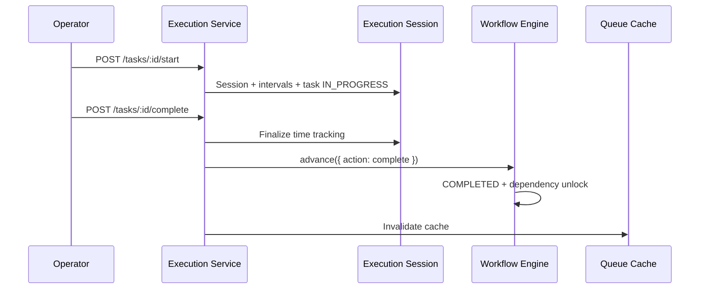

# Milestone 4 — Production Execution Engine

Implementation reference for operator task execution (start, pause, resume, hold, complete).

**Status:** Implemented  
**Depends on:** Milestones 1–3 (Workflow, Queue, Assignment)  
**Scope:** Task execution only — no QC, machine registry, planning board, inventory, dispatch, or analytics.

---

## Objective

Assigned operators execute production tasks. On completion, the **Workflow Engine** advances the workflow — the execution layer never activates next tasks directly.

```
Assigned Task → Operator starts → Works (pause/hold/notes/attachments)
  → Operator completes → workflowEngine.advance()
  → Dependency Engine activates next READY tasks
```

---

## Architecture



---

## Backend Module

```
backend/src/modules/production/execution/
├── execution.routes.ts
├── execution.controller.ts
├── execution.service.ts
├── execution.repository.ts
├── execution.dto.ts
├── execution.validation.ts
├── execution.access.ts
├── execution.constants.ts
├── execution-state-machine.ts
├── time-tracking.util.ts
├── index.ts
└── __tests__/execution.unit.test.ts
```

Registered at: `/api/v1/production/*`

---

## Data Model

| Model | Purpose |
|-------|---------|
| `WorkflowTaskExecutionSession` | One active session per task; time aggregates |
| `WorkflowTaskExecutionInterval` | WORKING / PAUSED / HOLD intervals |
| `WorkflowTaskHold` | Hold reason + notes + timestamps |
| `WorkflowTaskProductionNote` | Immutable operator notes |
| `WorkflowTaskAttachment` | R2 file metadata (IMAGE, PDF, PROOF, QC) |
| `WorkflowTaskExecutionAlert` | Supervisor request / issue report |

Partial unique index: one active session (`IN_PROGRESS`, `PAUSED`, `ON_HOLD`) per task.

---

## Execution Lifecycle

| Task Status | Session Status | Operator Action |
|-------------|----------------|-----------------|
| ASSIGNED | — | Start |
| IN_PROGRESS | IN_PROGRESS | Pause, Hold, Complete, Notes, Attachments |
| PAUSED | PAUSED | Resume |
| ON_HOLD | ON_HOLD | Release hold → IN_PROGRESS |
| COMPLETED | COMPLETED | — (workflow advanced) |

State validation uses `task-state-machine.ts` (unchanged) + `execution-state-machine.ts` for sessions.

---

## Time Tracking

Each session stores:

- `workingDurationSeconds`, `pausedDurationSeconds`, `holdDurationSeconds`
- `totalDurationSeconds` (sum at complete)
- `startedAt`, `pausedAt`, `resumedAt`, `completedAt`
- Multiple pause/resume cycles via `WorkflowTaskExecutionInterval`

Live elapsed time computed from `activeIntervalStartedAt` for manager dashboards.

---

## Workflow Integration

**Critical:** `executionService.completeTask()` calls:

```typescript
await workflowEngine.advance({
  workflowInstanceId,
  taskId,
  action: 'complete',
  actorId,
  remarks,
});
```

The execution service does **not** set downstream tasks to READY — that remains in `workflow.engine.ts` + `dependency-engine.ts`.

---

## API Endpoints

| Method | Path | Description |
|--------|------|-------------|
| `POST` | `/production/tasks/:taskId/start` | Start execution |
| `POST` | `/production/tasks/:taskId/pause` | Pause |
| `POST` | `/production/tasks/:taskId/resume` | Resume from pause |
| `POST` | `/production/tasks/:taskId/hold` | Put on hold |
| `POST` | `/production/tasks/:taskId/release-hold` | Release hold |
| `POST` | `/production/tasks/:taskId/complete` | Complete + workflow advance |
| `GET` | `/production/tasks/:taskId/execution` | Current session |
| `GET/POST` | `/production/tasks/:taskId/notes` | Production notes |
| `POST` | `/production/tasks/:taskId/attachments/presign` | R2 presign |
| `POST/GET` | `/production/tasks/:taskId/attachments` | Register / list |
| `POST` | `/production/tasks/:taskId/request-supervisor` | Alert |
| `POST` | `/production/tasks/:taskId/report-issue` | Alert |
| `GET` | `/production/departments/:departmentId/execution` | Manager live view |

---

## Hold Reasons

`ARTWORK_ISSUE`, `MACHINE_ISSUE`, `PAPER_ISSUE`, `POWER_FAILURE`, `CUSTOMER_CLARIFICATION`, `WAITING_MATERIAL`, `SUPERVISOR_REVIEW`, `OTHER`

---

## RBAC

| Role | Execute | View department execution |
|------|---------|---------------------------|
| STAFF (operator) | Own assigned tasks (`production.task.execute`) | No |
| MANAGER / ADMIN | Yes | Yes |
| SUPER_ADMIN | Yes | Yes |

Permission: `production.task.execute` (seeded for STAFF + MANAGER).

---

## Events & Audit

**Domain events:** `TASK_STARTED`, `TASK_PAUSED`, `TASK_RESUMED`, `TASK_HELD`, `TASK_COMPLETED`, `TASK_NOTE_ADDED`, `TASK_ATTACHMENT_ADDED`, `SUPERVISOR_REQUESTED`, `TASK_ISSUE_REPORTED`

Each mutation also writes:

- `WorkflowTaskHistory` (STARTED, PAUSED, RESUMED, ON_HOLD, COMPLETED)
- `WorkflowTimelineEvent` via extended `workflow-timeline.service.ts`
- `ActivityLog` (async via BullMQ)

Queue cache invalidated on execution events.

---

## Attachments

1. `POST .../attachments/presign` → R2 presigned PUT (`production/` folder)
2. Client uploads to R2
3. `POST .../attachments` → creates `FileAsset` + `WorkflowTaskAttachment`

Supported: images + PDF (10 MB, same as vendor documents).

---

## Frontend

```
frontend/src/features/production-queue/
├── components/
│   ├── operator-task-workspace-page.tsx
│   ├── operator-task-actions-panel.tsx
│   ├── department-execution-page.tsx
│   └── my-assigned-tasks-page.tsx (links to workspace)
├── hooks/use-production-execution-queries.ts
├── services/production-execution.service.ts
└── types/execution.types.ts
```

Routes:

- `/admin/production/my-tasks/[taskId]` — operator workspace
- `/admin/production/queues/[departmentId]/execution` — manager live view

STAFF operators can access `/admin/production/my-tasks/*` via middleware exception.

---

## Tests

```bash
cd backend
npm run test:execution
```

Covers: state machine, time tracking, RBAC access rules.

---

## Migration

```
prisma/migrations/20260627120000_production_execution_engine_m4/migration.sql
```

```bash
cd backend
npm run prisma:migrate
npm run seed:master
```

---

## Explicitly NOT Implemented (Later Milestones)

- QC inspection flows
- Machine registry / execution binding
- Planning board
- Inventory consumption
- Dispatch
- Reports / analytics

---

## Related Docs

- `docs/IMPLEMENTATION_MILESTONE_01_WORKFLOW_ENGINE.md`
- `docs/IMPLEMENTATION_MILESTONE_02_DEPARTMENT_QUEUE.md`
- `docs/IMPLEMENTATION_MILESTONE_03_ASSIGNMENT_ENGINE.md`
